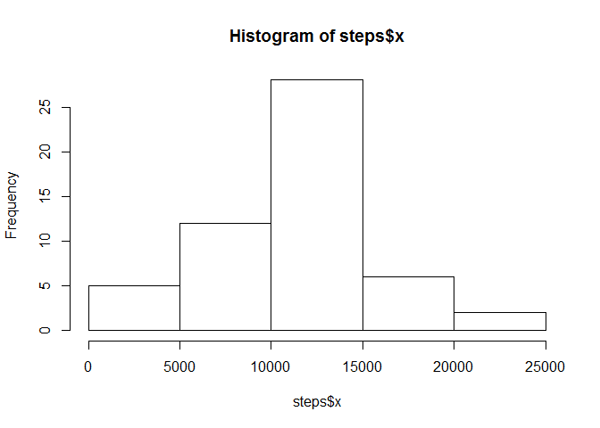
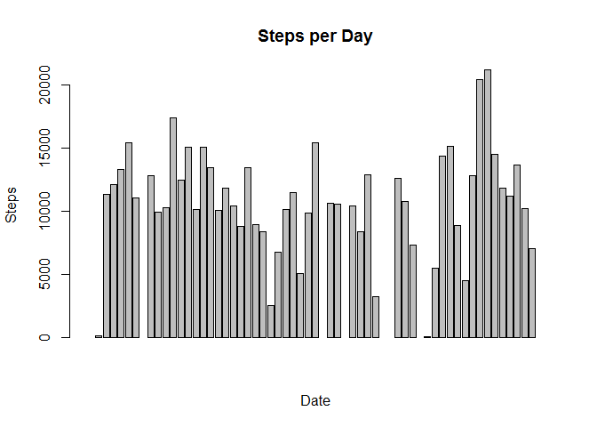
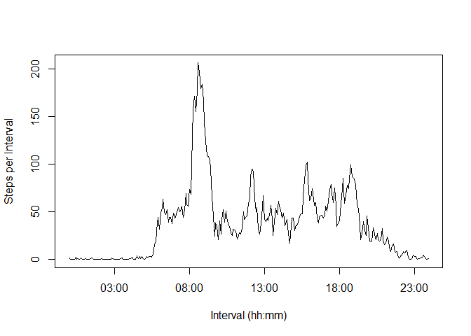
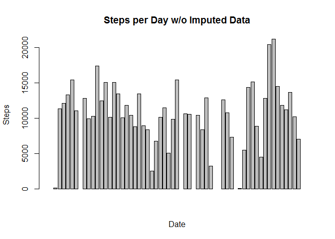
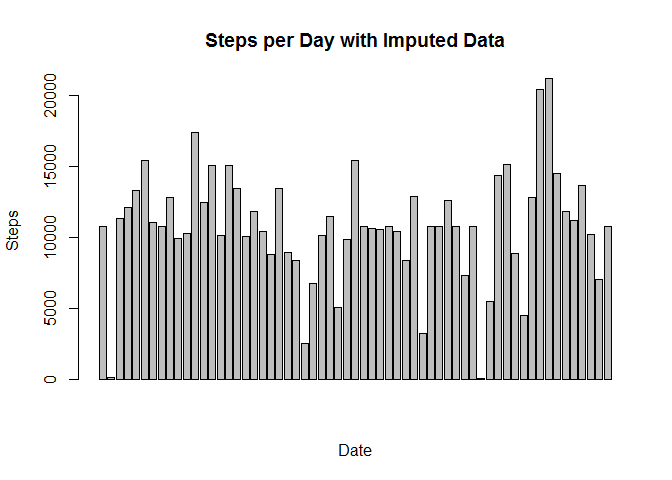
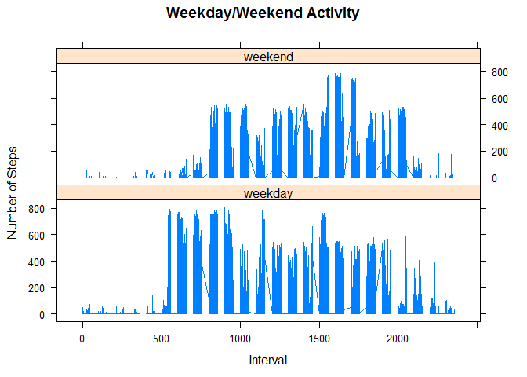

# Reproducible Research: Peer Assessment 1


## Loading and preprocessing the data
Lets load some libraries that we'll later.


```r
library(dplyr)
```

```
## 
## Attaching package: 'dplyr'
## 
## The following objects are masked from 'package:stats':
## 
##     filter, lag
## 
## The following objects are masked from 'package:base':
## 
##     intersect, setdiff, setequal, union
```

If activity.csv doesn't exist unzip it from the ZIP file.  


```r
if (!file.exists("activity.csv")) {
        unzip("activity.zip")
}
 
activity <- read.csv("activity.csv")
```

## What is mean total number of steps taken per day?

Use the aggregate function to find the total number of steps taken per day.  


```r
steps <- aggregate(activity$steps, by=list(Date=activity$date), FUN=sum)
```

The instructions said to produce a "histogram", but it sounded like what they really want is a barplot.  So I provided both.  

Histogram:

```r
hist(steps$x)
```

 

Bar Plot:

```r
barplot(steps$x, main = "Steps per Day", xlab = "Date", ylab = "Steps")
```

 

The mean and median steps per day are:  


```r
mean(steps$x, na.rm = TRUE)
```

```
## [1] 10766.19
```

```r
median(steps$x, na.rm = TRUE)
```

```
## [1] 10765
```


## What is the average daily activity pattern?

Plot of the average steps per interval:


```r
stepsbyinterval <- aggregate(activity$steps, by=list(interval=activity$interval), FUN=mean, na.rm = TRUE)

intervals <- strptime(sprintf("%04d",as.numeric(stepsbyinterval$interval)), format = "%H%M")

plot(intervals, stepsbyinterval$x, type = "l", xlab="Interval (hh:mm)", ylab="Steps per Interval")
```

 

The interval with the maximum number of steps per day, on average is:


```r
stepsbyinterval[ stepsbyinterval$x == max(stepsbyinterval$x), ]
```

```
##     interval        x
## 104      835 206.1698
```


## Imputing missing values

To impute missing data I plan to use the average for a given interval.  

First compute the mean steps for each interval:


```r
aveSteps <- aggregate(activity$steps, by=list(Date=activity$interval), FUN=mean, na.rm=TRUE)
```

Give the column meaningful names.


```r
names(aveSteps) <- c("interval", "mean.steps")
```

Lets create a copy of the activity dataframe and add to it a column that contains the 
average number of steps for that interval.


```r
act <- merge(activity, aveSteps, by = "interval")
head(act)
```

```
##   interval steps       date mean.steps
## 1        0    NA 2012-10-01   1.716981
## 2        0     0 2012-11-23   1.716981
## 3        0     0 2012-10-28   1.716981
## 4        0     0 2012-11-06   1.716981
## 5        0     0 2012-11-24   1.716981
## 6        0     0 2012-11-15   1.716981
```

Create a new dataset using steps where it's available and mean.steps where steps is NA.

I've created a small function to help me select where the steps value is NA.


```r
stepfunc <- function(a,b){
        
        if( is.na(a) ) {
                b
        } else {
                a
        }
        
} 
```

Force creation of a vector "a".

```r
a<-0
```

Now populate "a" with either the number of steps or, if teh number of steps is NA, the mean number of steps for that interval.

```r
for(i in  1:nrow(act)) {
        a[i]<-stepfunc(act[i,2], act[i,4])
        
}
head(a, n = 20L)
```

```
##  [1]  1.716981  0.000000  0.000000  0.000000  0.000000  0.000000  0.000000
##  [8]  0.000000  0.000000  0.000000  1.716981  0.000000  0.000000  0.000000
## [15]  0.000000 47.000000  0.000000  0.000000  0.000000  0.000000
```

Add the new column to the "act" dataset.

```r
act<- cbind(act,a)
head(act, n = 20L)
```

```
##    interval steps       date mean.steps         a
## 1         0    NA 2012-10-01   1.716981  1.716981
## 2         0     0 2012-11-23   1.716981  0.000000
## 3         0     0 2012-10-28   1.716981  0.000000
## 4         0     0 2012-11-06   1.716981  0.000000
## 5         0     0 2012-11-24   1.716981  0.000000
## 6         0     0 2012-11-15   1.716981  0.000000
## 7         0     0 2012-10-20   1.716981  0.000000
## 8         0     0 2012-11-16   1.716981  0.000000
## 9         0     0 2012-11-07   1.716981  0.000000
## 10        0     0 2012-11-25   1.716981  0.000000
## 11        0    NA 2012-11-04   1.716981  1.716981
## 12        0     0 2012-11-08   1.716981  0.000000
## 13        0     0 2012-10-12   1.716981  0.000000
## 14        0     0 2012-10-30   1.716981  0.000000
## 15        0     0 2012-11-26   1.716981  0.000000
## 16        0    47 2012-10-04   1.716981 47.000000
## 17        0     0 2012-11-27   1.716981  0.000000
## 18        0     0 2012-10-31   1.716981  0.000000
## 19        0     0 2012-11-18   1.716981  0.000000
## 20        0     0 2012-10-05   1.716981  0.000000
```


```r
stepsImputed <- aggregate(act$a, by=list(Date=act$date), FUN=sum)
barplot(steps$x, main = "Steps per Day w/o Imputed Data", xlab = "Date", ylab = "Steps")
```

 

```r
barplot(stepsImputed$x, main = "Steps per Day with Imputed Data", xlab = "Date", ylab = "Steps")
```

 

The mean and median steps per day with imputed data are:  


```r
mean(stepsImputed$x, na.rm = TRUE)
```

```
## [1] 10766.19
```

```r
median(stepsImputed$x, na.rm = TRUE)
```

```
## [1] 10766.19
```

This closely matches the mean and median values for the data without imputed values.  I suspect that this is due to the way that I imputed values, by using the mean for the interval.


## Are there differences in activity patterns between weekdays and weekends?

Add a weekday column to the act dataset


```r
weekday<-0   #Force creation of a weekday variable 
for(i in  1:nrow(act)) {
        weekday[i] <- weekdays(as.Date(act[i,3],'%Y-%m-%d'))
        
}

act<- cbind(act,weekday)

act$wday <- as.factor(ifelse(act$weekday == "Saturday" | act$weekday == "Sunday","weekend", "weekday"))
```

Plot weekday and weekend activity


```r
library(lattice)
xyplot(steps~interval | factor(wday), data=act, pch=19, main="Weekday/Weekend Activity", xlab="Interval",  ylab="Number of Steps",layout=c(1,2),type="l")
```

 

We can see that there is a difference in activity patterns between weekdays and weekends.


